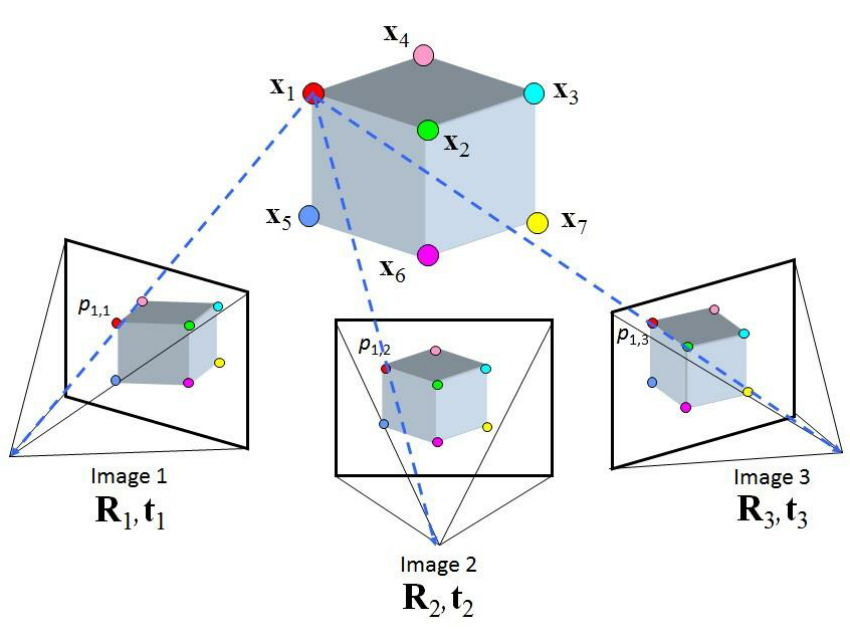
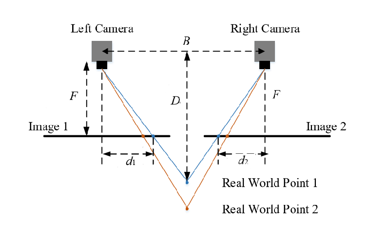

# Methodology
In our project, we propose to use a vision based system to develop perception algorithms for DSO. We introduce the different hardware and software aspects of the proposed perception algorithm.
## Sensors
There are many different types of cameras available in the market that can be used for our project. We mainly focus on Monocular cameras and stereo cameras.
### Monocular camera
Monocular cameras use a single sensor to percieve the environment around them. They are widely used in robotic applications because they are cheap and can provide a rich data about the environment. Monocular cameras produce a 2D representation of the 3D world and because of this, important depth information about the environment can be lost. There are however, algorithms to estimate the depth information from monocular camera such as: ==structure from motion, depth from defocus== etc. These methods can however be less effective than stereo cameras.

The image formation in a monocular camera can be modelled by the perspective projection model which is given by:

$$
\mathbf{p} = \frac{1}{Z}\begin{bmatrix}
f_x & 0 & c_x  \\
 0 & f_y & c_y \\ 
 0 &0& 1
 \end{bmatrix} \mathbf{P}
$$

Where $\mathbf{p}$ is the position of the image on the image plane in the homogenous coordinates, $f_x$, $f_y$, $c_x$ and $c_y$ are the focal lengeths and the principle point coordinates respectievely. Moreover, $\mathbf{P}$ is the position of the object in the 3D scene. It must be noted that a monocular camera produces a 2D projection of the 3D scene, therefore, it cannot measure directly the depth data that is contained in the scene. 

There are some algorithms that can be used to estimate the depth data from a monocular camera. A commonly used technique is called structure from motion. This involves capturing images from the same camera at two different camera viewpoints, and using certain feature points that are same on both pictures to reconstruct a 3D structure of the scene. 

The key steps for estimating the 3d structure from a monocular camera using structure from motion are:

 - Capture multiple images from different viewpoints
 - Detect features such as corners that can be easily distinguished in different images
 - Match the detected features in one image to the other.
 - Estimate the motion of the camera between the two images. This can be done by solving the perspective-n-point problem.
 - The 3D position of the feature points are found by {==triangulation==}.
  
### Stereo camera
Stereo cameras use a similar methodology to find the 3D data of the scene. The major difference is that rather than using a single camera to obtain multiple pictures of the scene, stereo cameras make use of multiple cameras that have a known relative transformation to obtain multiple images of the scene at the same time. 

## Segmentation
The stereo camera will give us dense data about all the pixels in the image. However, in most cases, we only need certain sparse data that pertains to our problem. In this case, we only need RGB-D data of the deformable slender object that we will be manipulating. To achieve this, we use segmentation to find which pixels in the image correspond to the DSO. Image segmentation is the process of splitting an image into different sets of pixels based on some condition. There are different methods of doing image segmentation:

- **Semantic segmentation**: Classifies the pixels based on the meaning of the object. Employs deep learning methods that can learn the pixel based classification problem. Example U-net
- **Region-based segmentation**: Classifies the pixels based on similarities between nearby pixels. The criteria for similarity can be color, texture etc. 

