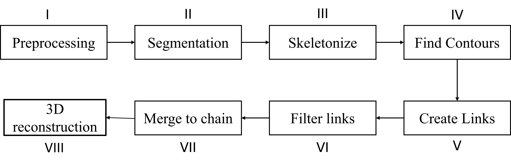
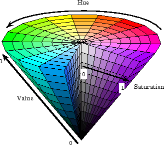

# Methodology
In our project, we propose to use a vision based system to develop perception algorithms for DSO. We introduce the different hardware and software aspects of the proposed perception algorithm.
## Sensors
There are many different types of cameras available in the market that can be used for our project. We mainly focus on Monocular cameras and stereo cameras.
### Monocular camera
Monocular cameras use a single sensor to percieve the environment around them. They are widely used in robotic applications because they are cheap and can provide a rich data about the environment. Monocular cameras produce a 2D representation of the 3D world and because of this, important depth information about the environment can be lost. There are however, algorithms to estimate the depth information from monocular camera such as: ==structure from motion, depth from defocus== etc. These methods can however be less effective than stereo cameras.

The image formation in a monocular camera can be modelled by the perspective projection model which is given by:

$$
\mathbf{p} = \frac{1}{Z}\begin{bmatrix}
f_x & 0 & c_x  \\
 0 & f_y & c_y \\ 
 0 &0& 1
 \end{bmatrix} \mathbf{P}
$$

Where $\mathbf{p}$ is the position of the image on the image plane in the homogenous coordinates, $f_x$, $f_y$, $c_x$ and $c_y$ are the focal lengeths and the principle point coordinates respectievely. Moreover, $\mathbf{P}$ is the position of the object in the 3D scene. It must be noted that a monocular camera produces a 2D projection of the 3D scene, therefore, it cannot measure directly the depth data that is contained in the scene. 

There are some algorithms that can be used to estimate the depth data from a monocular camera. A commonly used technique is called structure from motion. This involves capturing images from the same camera at two different camera viewpoints, and using certain feature points that are same on both pictures to reconstruct a 3D structure of the scene. 

The key steps for estimating the 3d structure from a monocular camera using structure from motion are:

 - Capture multiple images from different viewpoints
 - Detect features such as corners that can be easily distinguished in different images
 - Match the detected features in one image to the other.
 - Estimate the motion of the camera between the two images. This can be done by solving the perspective-n-point problem.
 - The 3D position of the feature points are found by {==triangulation==}.
  
### Stereo camera
Stereo cameras use a similar methodology to find the 3D data of the scene. The major difference is that rather than using a single camera to obtain multiple pictures of the scene, stereo cameras make use of multiple cameras that have a known relative transformation to obtain multiple images of the scene at the same time. 

The projection matrix of the camera that we are using in this project is found to be:

$$\mathbf{K} = \begin{bmatrix} 595.998 & 0 & 320.825 \\
0 & 595.998 &239.252 \\
0 & 0 &1\end{bmatrix} $$

## I. Preprocessing
The RGB-D data obtained from the camera is preprocessed to downsample it to a standard size of $640\times 480$. Further the image is filtered with gaussian blurring to smooth out the image for noise. A gaussian kernal of {==size==} 

## II. Segmentation
The stereo camera will give us dense data about all the pixels in the image. However, in most cases, we only need certain sparse data that pertains to our problem. In this case, we only need RGB-D data of the deformable slender object that we will be manipulating. To achieve this, we use segmentation to find which pixels in the image correspond to the DSO. Image segmentation is the process of splitting an image into different sets of pixels based on some condition. There are different methods of doing image segmentation:

- **Semantic segmentation**: Classifies the pixels based on the meaning of the object. Employs deep learning methods that can learn the pixel based classification problem. Example U-net
- **Region-based segmentation**: Classifies the pixels based on similarities between nearby pixels. The criteria for similarity can be color, texture etc. 

### Semantic segmentation
Semantic segmentation is typically done using deep-learning models. They have the ability to learn the meaning behind the image and therefore successfully classify the pixels that belong to a certain kind of object. The deep learning models that do this have an autoencoder architecture. Unet is a highly successful model that employs skip connections that ensures that finer details of the image can be successfully classified. To train the network for semantic segmenations, we need to have poxel wise labels for each image in the training data. The training is done to minimise the focal loss for each pixel. 

Semantic segmenation requires large amounts of data to give accurate results. There are other methods of segmentation that can be used to segment the deformable slender object from the image.

### Region-based segmentation
Segmentation can also be performed based on other aspects of the image. For example, a group of pixels having the same color or texture can be segmented. In this project, we adopt color based segmentation to find the pixels that are associated with the DSO. For color-based segmentation, we convert the RGB image into the HSV color space because it is less dependant on lighting conditions. In our case, the DSO is blue in color, so we set the limits in the HSV Space as:

\\[\mathrm{Lower limit} = [100,150,50]\\]
\\[\mathrm{Upper limit} = [140, 255, 255]\\]

All the pixels that do not belong in this interval are equated to zero. 

## III. Skelotonize
To obtain the topology of the DSO from the image, we construct the skeloton of the image using Zhang's method [@Zhang1984]. Zhang's Method for skeletonization is an efficient algorithm for thinning a binary image to obtain a skeleton representation of shapes. The method is based on iteratively removing pixels from the boundaries of the objects in the binary image while preserving the topology and structure of the shapes. Zhang’s algorithm works by applying a series of conditional rules that allow the removal of boundary pixels in a way that retains the essential structure of the object. Specifically, it works by iterating through the image and checking each pixel's neighborhood for continuity, and then removing pixels that satisfy the continuity. This process continues until no further pixels can be removed, resulting in a skeleton that represents the object as a thin, one-pixel-wide line.

<figure markdown="span">
    
    <figcaption style="text-align: center; font-style: italic;">1 pixel width representation of the rope</figcaption>
</figure>

## IV. Find contours
Now that we have a one dimensional representation of the DSO in the image plane, we can find the contours that represent the topology of the DSO. Contours are a sequence of points on the skeleton that are continous. 

## V. Create Links
Points in the contour are used to create links. A link is a collection of points in the countour that satisfies a direction continuity assumption. We assume that the DSO will deform in a smooth manner, this means that the image created by the DSO will also be smooth. If there are large changes in the direction of the countour, we stop the growing the link.

## VI. Filter Links

## VII. Merge chains

## 3D reconstruction
Using the depth data at the points where the rope exists, we can reconstruct the shape of the rope in 3D. This is done by first inverting the perspective projection through:

\[\mathbf{P}_x = \frac{(\mathbf{p}_x - c_x)}{f_x} \mathbf{P}_z\]

\[\mathbf{P}_y = \frac{(\mathbf{p}_y - c_y)}{f_y} \mathbf{P}_z\]

The z-cordinate can be obtained directly from the depth image corresponding to $p_x$ and $p_y$. Using this, we can approximate the 3D shape of the DSO. To be robust to occlusions, we can further use temporal dependencies on the DSO.

# Temporal effects
The evolution of the DSO under manipulation will follow the dynamics of the DSO. This depends on the matrial parameters, the external and internal forces on the DSO. The external forces include gravity, manipulation forces and contact with other objects in the environment. On the other hand, the internal forces could arise from the objects elastisity, damping etc. Some of the forces, like gravity, can be easy to measure, however, internal forces or forces from contact with the environment may be difficult to measure from an experiment. Therefore, we do not use the full dynamics of the DSO, rather we make the assumption that the dynamics of the DSO is a smooth and continous. 
We can use the assumption of smoothness to identify the shape of the DSO under occlusion where we cannot directly measure the DSO position using the camera. There can be many different approaches to leveraging this assumption. In this project, we make use of smoothing splines to obtain a smooth 

...

## References

\bibliography