<h1 align="center">Occlusion-aware segmentation of deformable slender objects</h1>
<h2> Abstract</h2>

We propose an algorithm for detecting the topology of a deformable slender object (DSO) in terms of its self intersections. The topology refers to the order of self intersections that the DSO has with itself. Based on the topology of the DSO, we can define the knot structure that it forms. The proposed algorithm is important in robotic manipulaton of DSO such as cables and ropes. Such deformable objects are oniquitous in the natural environment, however, robotic manipulation still primarly focuses on the rigid object assumption. The main challenge associated with the manipulation of deformable objects come from the perception of the object. The perception challenges arise from two key factor: (1) DSO lack a fied shape, making their tracking and modelling complex, and (2) self occlusions occur in certain configurations of the DLO, where parts of the DLO obscure other sections. Traditional object detection methods often rely on distinct geometric features that are effective for rigid objects but fail when applied to deformable ones. To address these challenges, we propose a DLO segmentation scheme that can segment DLOs from a scene while also accounting for the order of self-occlusion. Our approach involves a two-stage process: the first stage focuses on segmentation, while the second stage resolves intersection ambiguities. For segmentation, we propose to utilize a pre-trained segmentation backbone and fine-tune it on a DLO-specific dataset to improve accuracy. Once the intersection positions are identified, we hypothesize that the order of intersection can be predicted by examining the change in RGB values along the DLOs. Specifically, for the DLO on top, the RGB change along its length will be minimal, whereas for the DLO beneath, a sharp change in RGB values will be observed. We will validate this self-occlusion-aware segmentation method using real-world images of DLOs, evaluating both the accuracy of pixel segmentation and the correct prediction of intersection order. The perception and segmentation of deformable linear objects will allow for more natural interactions between robots and DLO. This will have an impact in construction, cable laying, medical applications etc. where robots can be used for DLO manipulation. In particular, the order of self-occlusion is important for knot-tying tasks that are common in medical suturing.

<figure markdown="span">
    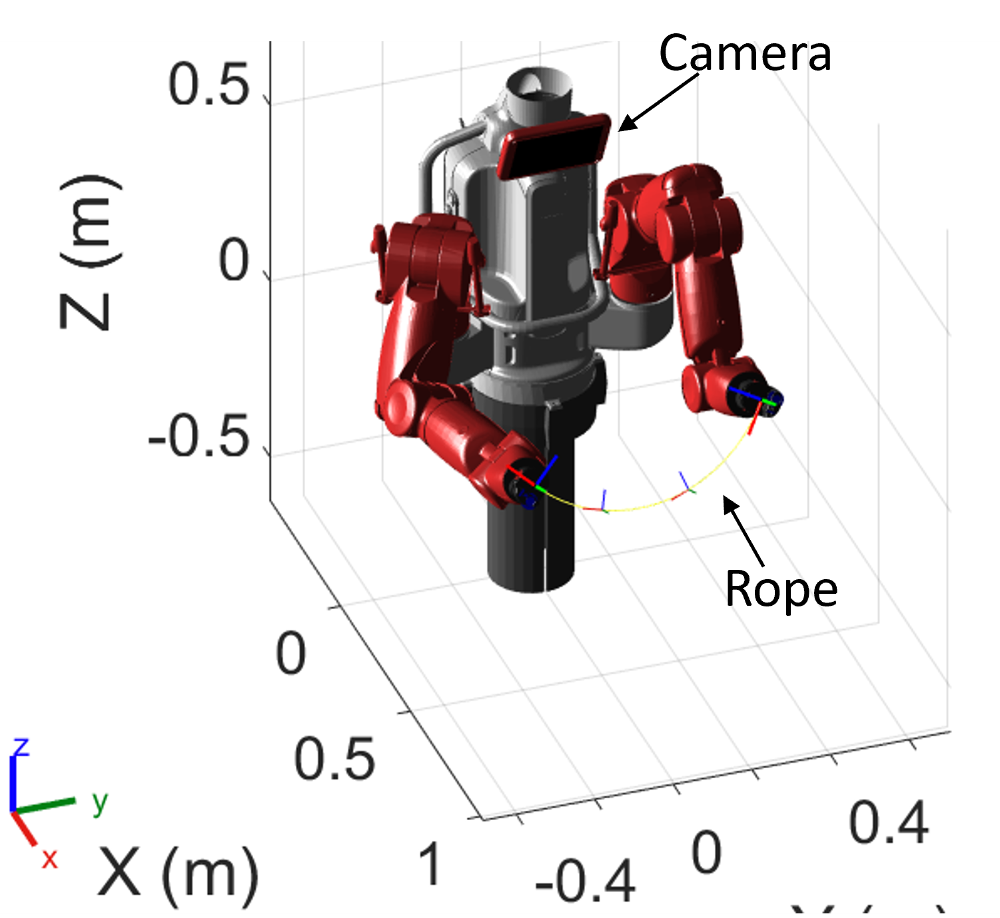
    <figcaption style="text-align: center; font-style: italic;">**Figure 1:** Vision based perception of DSO manipulation. During manipulation, there may be different types of occlusions which the proposed segmentation algorithm must be robust to.</figcaption>
</figure>

<h2 align='center'>Introduction</h2>

Defomable objects are all around us and humans are able to naturally interact with them to accomplish various tasks that are not possible with rigid objects. There are several challenges that limit the use of robots for the manipulation of deformable objects. Unlike rigid objects, deformable objects exhibit significant flexibility and elasticity that make it difficult to model them effectively. Especially in the case of active manipulation, the configuration of the object is dynamic and is subject to change througout the manipulation. Without accurate perception algorithms for deformable objects, robots would struggle to find the current state of the deformable object and therefore cause large errors in manipulation. Moreover, we need perception methods that do not impose additional forces and moments on the deformable objects. In this project, we propose to use a vision based method to percieve a DSO that will be manipulated by a robot. 

There are many different vision based methods that we can adopt to develop algorithms for the perception of DSO in terms of the hardware and the software. The different hardware solutions available to be used are:

### Monocular camera
Monocular cameras use a single sensor to percieve the environment around them. They are widely used in robotic applications because they are cheap and can provide a rich data about the environment. Monocular cameras produce a 2D representation of the 3D world and because of this, important depth information about the environment can be lost. 

<figure markdown="span">
    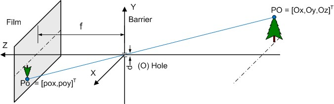
    <figcaption style="text-align: center; font-style: italic;">**Figure 2:** Perspective projection model of a camera [[1]](https://jordicenzano.name/front-test/2d-3d-paradigm-overview-2011/camera-model/)</figcaption>
</figure>

The image formation in a monocular camera can be modelled by the perspective projection model which is given by:
$$
\mathbf{p} = \frac{1}{Z}\begin{bmatrix}
f_x & 0 & c_x  \\
 0 & f_y & c_y \\ 
 0 &0& 1
 \end{bmatrix} \mathbf{P}
$$

Where $\mathbf{p}$ is the position of the image on the image plane in the homogenous coordinates, $f_x$, $f_y$, $c_x$ and $c_y$ are the focal lengeths and the principle point coordinates respectievely. Moreover, $\mathbf{P}$ is the position of the object in the 3D scene. It must be noted that a monocular camera produces a 2D projection of the 3D scene, therefore, it cannot measure directly the depth data that is contained in the scene. There are however, algorithms to estimate the depth information from monocular camera. The two main classes of algorithms are:
 - Triangulation based methods: Ex. structure from motion{==cite==}
 - Depth of field methods: Eg. depth from defocus{==cite==}

A commonly used triangulation based technique is called structure from motion. This involves capturing images from the same camera at two different camera viewpoints, and using certain feature points that are same on both pictures to reconstruct a 3D structure of the scene. 

<figure markdown="span">
    
    <figcaption style="text-align: center; font-style: italic;">**Figure 2:** By detecting the change of some feature points in the image plane, the motion of the camera can be estimated. And using this, the 3D representation of the scene can be obtained from pictures at different viewpoints.{==cite==}</figcaption>
</figure>

The key steps for estimating the 3d structure from a monocular camera using structure from motion are:

 - Capture multiple images from different viewpoints
 - Detect features such as corners that can be easily distinguished in different images
 - Match the detected features in one image to the other.
 - Estimate the motion of the camera between the two images. This can be done by solving the perspective-n-point problem.
 - The 3D position of the feature points are found by {==triangulation==}.

Another class of methods make use of the focus of the image produced to estimate the depth information. A monocular camera has a limited range of positions where it can capture a sharp image. This can be seen from:
<figure markdown="span">
    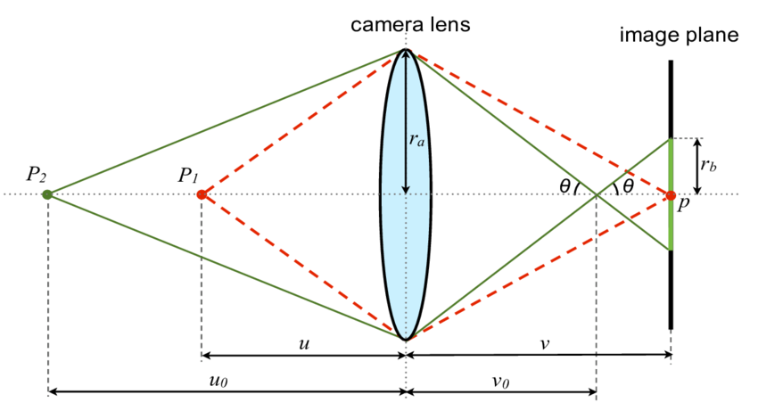
    <figcaption style="text-align: center; font-style: italic;">**Figure 2:** Objects at a distance $u$ from the lens creates a sharp image at the image plane. However, other objects will result in a blurred image.[[2]](https://www.researchgate.net/publication/273947737/figure/fig8/AS:650806445473802@1532175756521/Depth-defocus-relationship-The-same-object-point-placed-at-different-distances-will-be.png)</figcaption>
</figure>

USing the blur circle radius $r_b$, we can have an estimate of the depth by the equation: 

\[r_b(z) = \frac{A(|z-z_f|)}{z}\frac{f}{z_f-f}\]
Where $A$ is the aperture size, $f$ is the focal length, $z_f$ is the distance to the focal plane and finally $z$ is the depth of the object. If we know the blur circle radius, we can solve for $z$ to estimate the depth from defocus.

  
### Stereo camera
Stereo cameras use a triangulation method to find the 3D data of the scene. The major difference is that rather than using a single camera to obtain multiple pictures of the scene, stereo cameras make use of multiple cameras that have a known relative transformation to obtain multiple images of the scene at the same time. 

<figure markdown="span">
    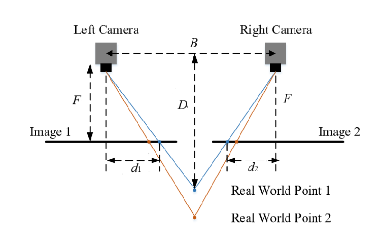
    <figcaption style="text-align: center; font-style: italic;">**Figure 3:** Using cameras that are a known fixed ttransformation apart, depth in the scene can be estimated using the difference in the image produced by the two sensors.{==cite==}</figcaption>
</figure>

The projection matrix of the camera that we are using in this project is found to be:

$$\mathbf{K} = \begin{bmatrix} 595.998 & 0 & 320.825 \\
0 & 595.998 &239.252 \\
0 & 0 &1\end{bmatrix} $$

<h2 align='center'> Methodology</h2>
In our project, we propose to use a vision based system to develop perception algorithms for DSO. We introduce the different hardware and software aspects of the proposed perception algorithm.

<figure markdown="span">
    
    <figcaption style="text-align: center; font-style: italic;">**Figure 4:** The steps taken in this methodology</figcaption>
</figure>

## I. Preprocessing
The RGB-D data obtained from the camera is preprocessed to downsample it to a standard size of $640\times 480$. Further the image is filtered with gaussian blurring to smooth out the image for noise. A gaussian kernal of {==size==} 

<figure markdown="span">
    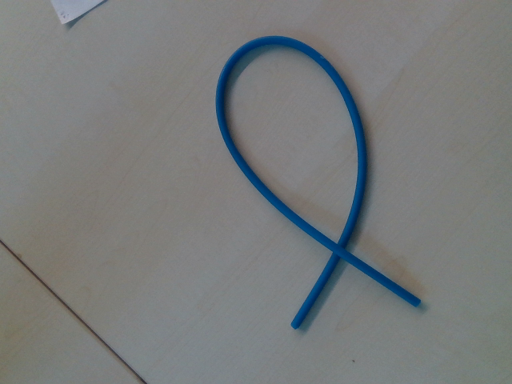
    <figcaption style="text-align: center; font-style: italic;">**Figure 5:** A typical example of an image of the DSO being manipulated</figcaption>
</figure>

## II. Segmentation
The stereo camera will give us dense data about all the pixels in the image. However, in most cases, we only need certain sparse data that pertains to our problem. In this case, we only need RGB-D data of the deformable slender object that we will be manipulating. To achieve this, we use segmentation to find which pixels in the image correspond to the DSO. Image segmentation is the process of splitting an image into different sets of pixels based on some condition. There are different methods of doing image segmentation:

- **Semantic segmentation**: Classifies the pixels based on the meaning of the object. Employs deep learning methods that can learn the pixel based classification problem. Example U-net
- **Region-based segmentation**: Classifies the pixels based on similarities between nearby pixels. The criteria for similarity can be color, texture etc. 

### Semantic segmentation
Semantic segmentation is typically done using deep-learning models. They have the ability to learn the meaning behind the image and therefore successfully classify the pixels that belong to a certain kind of object. The deep learning models that do this have an autoencoder architecture. Unet is a highly successful model that employs skip connections that ensures that finer details of the image can be successfully classified. To train the network for semantic segmenations, we need to have poxel wise labels for each image in the training data. The training is done to minimise the focal loss for each pixel. 

<figure markdown="span">
    
    <figcaption style="text-align: center; font-style: italic;">**Figure 6:** Deep-learning based semantic segmentation model.</figcaption>
</figure>

Semantic segmenation requires large amounts of data to give accurate results. There are other methods of segmentation that can be used to segment the deformable slender object from the image.

### Region-based segmentation
Segmentation can also be performed based on other aspects of the image. For example, a group of pixels having the same color or texture can be segmented. In this project, we adopt color based segmentation to find the pixels that are associated with the DSO. For color-based segmentation, we convert the RGB image into the HSV color space because it is less dependant on lighting conditions. In our case, the DSO is blue in color, so we set the limits in the HSV Space as:

\\[\mathrm{Lower limit} = [100,150,50]\\]
\\[\mathrm{Upper limit} = [140, 255, 255]\\]

All the pixels that do not belong in this interval are equated to zero. 

<figure markdown="span">
    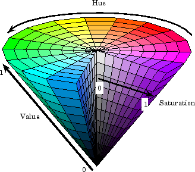
    <figcaption style="text-align: center; font-style: italic;">**Figure 7:** HSV color spaced used for color based segmentation</figcaption>
</figure>

<figure markdown="span">
    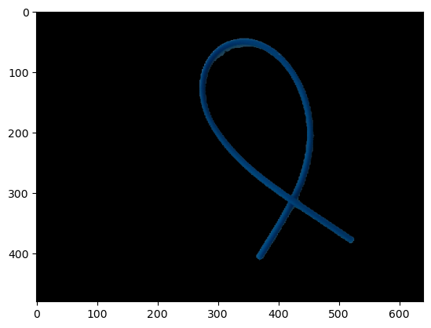
    <figcaption style="text-align: center; font-style: italic;">**Figure 8:** Example image after color based segmentation</figcaption>
</figure>

## III. Our method
To obtain the topology of the DSO from the image, we construct the skeloton of the image using Zhang's method [@Zhang1984]. Zhang's Method for skeletonization is an efficient algorithm for thinning a binary image to obtain a skeleton representation of shapes. The method is based on iteratively removing pixels from the boundaries of the objects in the binary image while preserving the topology and structure of the shapes. Zhang’s algorithm works by applying a series of conditional rules that allow the removal of boundary pixels in a way that retains the essential structure of the object. Specifically, it works by iterating through the image and checking each pixel's neighborhood for continuity, and then removing pixels that satisfy the continuity. This process continues until no further pixels can be removed, resulting in a skeleton that represents the object as a thin, one-pixel-wide line.

<figure markdown="span">
    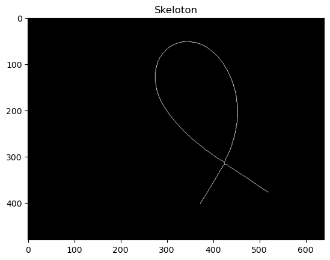
    <figcaption style="text-align: center; font-style: italic;">**Figure 9:** 1 pixel width representation of the rope</figcaption>
</figure>

Now that we have a one dimensional representation of the DSO in the image plane, we can find the contours that represent the topology of the DSO. Contours are a sequence of points on the skeleton that are continous. When occlusions occur, the image of the rope might not be continous and we may have several disjoint contours. Moreover, when there are self-occlusions, the contour might not follow the actual direction of the DSO an example of this is shown in:
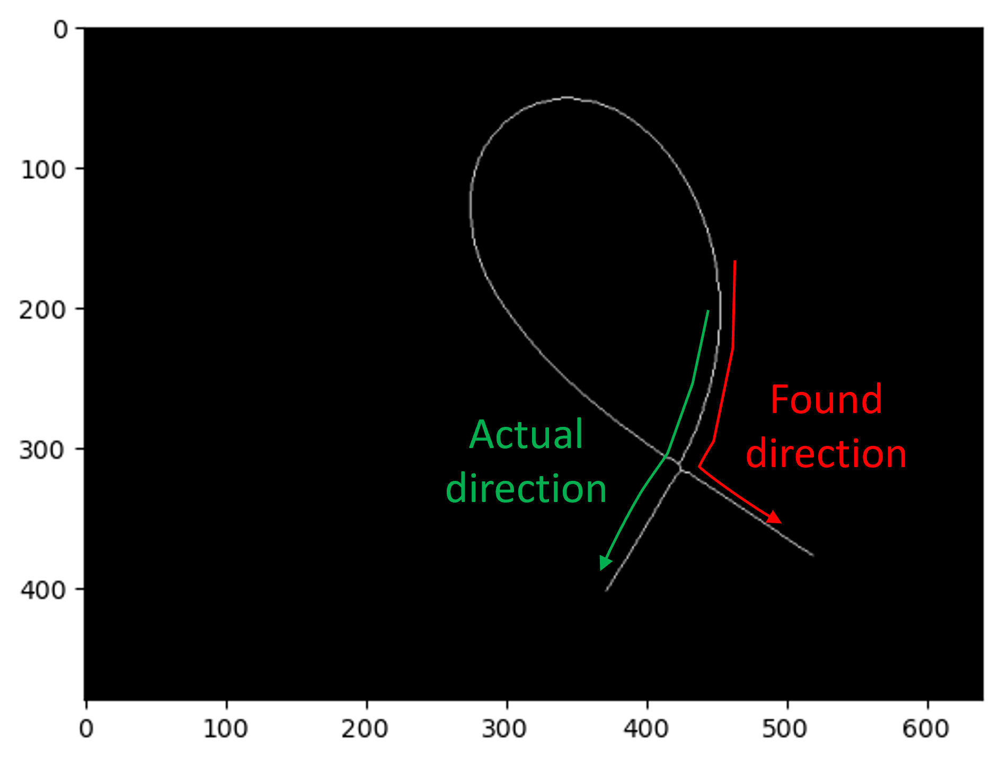

To overcome this problem, we design an algorithm that operates on smaller segments of each contour to identify locally linear chains of connected points. For each contours, it traverses the points sequentially and splits it into smaller segments based on the local curvature. The traversal begins by initiallizing a starting point for the current segment. As points are added, the algorithm checks whether the euclidean distance between the segment starting point and the current point exceeds a fixed segment length $l_{thresh}$. If this length threshold is reached, the direction of the current segment is calculated using $\theta_i = (x_s - x_i,y_s - y_i)$ where $(x_s,y_s)$ and $(x_i, y_i)$ are the positions of the start of the segment and the current point in the image plane. If the angle between the current and the previous segment is below a predefined threshold $\theta_{thresh}>= \theta_i \cdot \theta_{i-1}$, this segment is added to the chain. Otherwise, a new chain is initialized. Through this method, we obtain a set of chains that are spacially coherant.

<figure markdown="span">
    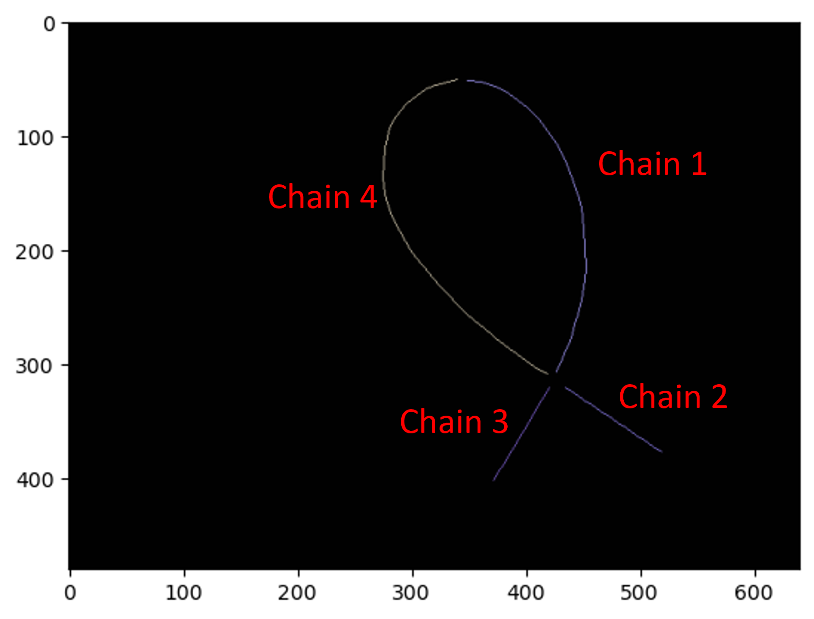
    <figcaption style="text-align: center; font-style: italic;">**Figure 1:** The different chains created from the contours of the DSO skeleton.</figcaption>
</figure>

The disjoint chains should now be rejoined to form the sequence of points that form the skeleton of the DSO. Each chain has two ends, so for an image that has $n$ chains, the total number of ends will be $2n$. The number of possible combinations are $\frac{n(n-2)}{2}$. To decide how the combination of chains should be, we use the hungarian algorithm which requires a cost matrix $\mathbf{C}$ that determines the cost of every possible assignment. The hangarian algorithm tries to minimise the cost function:

\[\min \sum_{k=1}^{2n} \mathbf{C}(k,\sigma(k))\]

where $\sigma(i)$ is the end of the chain that is assigned to the end at $i$. The cost associated with connecting end $k$ with end $l$ is computed as a combination of the curvature $C_c(k,l)$ and the euclidean distance $C_e(k,l).

\[C(k,l) = \lambda_e C_e(k,l) +\lambda_c C_c(k,l)\]

\[C_{k,l} = \lambda_e \sqrt{(p_k - p_{l})^2} + \lambda_c \left(\cos^{-1}\left(\frac{(p_k-p_l)\cdot p'_k}{\|(p_k-p_l)\| \|p'_k\|}\right) + \cos^{-1}\left(\frac{(p_k-p_l)\cdot p'_l}{\|(p_k-p_l)\| \|p'_l\|}\right)\right)\]

The euclidean norm ensures that the two endds are close to each other and the curvature cost will ensure that joining them together will not cause a sharp change in the direction of the rope. We also have a few special cases that must be accounted for such as one end of a chain is not allowed to be joined with itself. To discourage this, we populate the diagonal elements of the cost matrix with large numbers, in this case it is chosen to be $10^5$. The values of the diagonal elements and the weightage for euclidean and curvature cost is found through trial and error to see which provides the best performance.  The final weightage that we used are $\lambda_e = 0.001$ and $\lambda_c = 1$

<figure markdown="span">
    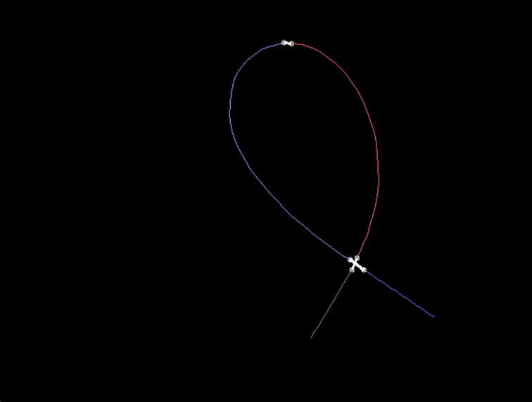
    <figcaption style="text-align: center; font-style: italic;">**Figure 1:** The disjoint chains are connected based on the solution of the hungarian algorithm.</figcaption>
</figure>

  

<figure markdown="span">
    {'width: 40%'}
    <figcaption style="text-align: center; font-style: italic;">**Video 1:** Overview of the image processing</figcaption>
</figure>

## 3D reconstruction
Using the depth data at the points where the rope exists, we can reconstruct the shape of the rope in 3D. This is done by first inverting the perspective projection through:

\[\mathbf{P}_x = \frac{(\mathbf{p}_x - c_x)}{f_x} \mathbf{P}_z\]

\[\mathbf{P}_y = \frac{(\mathbf{p}_y - c_y)}{f_y} \mathbf{P}_z\]

The z-cordinate can be obtained directly from the depth image corresponding to $p_x$ and $p_y$. Using this, we can approximate the 3D shape of the DSO.

  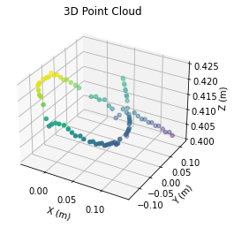
  <figcaption style="font-style: italic; margin-top: 8px;">
    <strong>Figure 1:</strong> Overview of the image processing
  </figcaption>

Given an image of the rope taken from an RGB-D camera, we can use the spatial relationship between different parts of the DSO to obtain a coherent 3D representation of the DSO. However, during occlusions, we have missing parts of the DSO and disjointsections of the DSO in the image. To account for the occlusions, we also make use of some temporal dependencies. 

# Temporal dependencies
The evolution of the DSO under manipulation will follow the dynamics of the DSO. This depends on the matrial parameters, the external and internal forces on the DSO. The external forces include gravity, manipulation forces and contact with other objects in the environment. On the other hand, the internal forces could arise from the objects elastisity, damping etc. Some of the forces, like gravity, can be easy to measure, however, internal forces or forces from contact with the environment may be difficult to measure from an experiment. Therefore, we do not use the full dynamics of the DSO, rather we make the assumption that the dynamics of the DSO is a smooth and continous. 
We can use the assumption of smoothness to identify the shape of the DSO under occlusion where we cannot directly measure the DSO position using the camera. There can be many different approaches to leveraging this assumption. In this project, we make use of smoothing splines to obtain a smooth representation of the DSO shape that remove outliers and fill missing information.

To leverage the temporal dependencies, we use a video obtained of the manipulation of the DSO. Using the spacial dependence, we obtaine $(x(t), y(t), z(t))$ for various points on the DSO throughout the manipulation time. We fit 3rd order splines with a smoothing factor of 0.5 for $x(t)$, $y(t)$ and $z(t)$. The spline is then used to find missing data due to occlusions. Using this method, we are able to estimate the shape of the DSO even when it is occlusded by a manipulator.

<h2 align='center'> Results</h2>

To test our methodolgy of making segmentation of DSOs aware of occlusions that may be unavaoidable during manipulation, we choose a slender object that can be used as the object for manipulation. To simplify our experiments, we choose the manipulate the DSO with our hands rather than using a robotic manipulator. Although our end-goal is for this method to be used for robotic manipulation, we can use hand manipulation because the problems like occlusions will still be present in hand manipulation. 

We initialize the experiment by placing the DSO on a table such that there are no occlusions of the DSO. We record a video of the DSO while we move the DSO such that there are occlusions due to our hand as well as due to other parts of the DSO itself. We investigate the performance of our method firstly by only considering the spacial dependenciesof the DSO. We then investigate how the results change when we incorporate the temporal dependencies as well. The video of the DSO manipulation conducted is shown

<figure markdown="span">
    {'width: 40%'}
    <figcaption style="text-align: center; font-style: italic;">**Video 2:** Manipulation of the DSO</figcaption>
</figure>

Explointing the spacial dependencies only, we attempt to find the 3D reconstruction of the DLO during manipulation. The reconstruction throughout the manipulation experiment is shown in video

<figure markdown="span">
    {'width: 40%'}
    <figcaption style="text-align: center; font-style: italic;">**Video 4:** When there are inevitable occlusions of the DSO by the manipulator. There are missing points on the DSO image.</figcaption>
</figure>

Now using the temporal dependancies, we can create a more accurate reconstruction of the manipulated object
<figure markdown="span">
    {'width: 40%'}
    <figcaption style="text-align: center; font-style: italic;">**Video 4:** When there are inevitable occlusions of the DSO by the manipulator. There are missing points on the DSO image.</figcaption>
</figure>
# References

[1] M. Saha and P. Isto, “Manipulation planning for deformable linear objects,” IEEE Transactions on Robotics, vol. 23, no. 6, pp. 1141–1150, 2007.