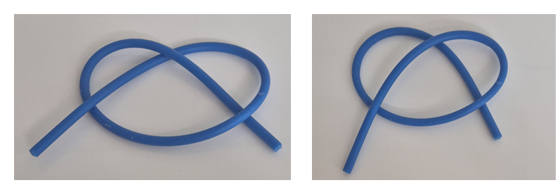

<h1 align="center">Occlusion-aware segmentation of deformable slender objects</h1>
<h2> Abstract</h2>

We propose an algorithm for detecting the topology of a deformable slender object (DSO) in terms of its self intersections. The topology refers to the order of self intersections that the DSO has with itself. Based on the topology of the DSO, we can define the knot structure that it forms. The proposed algorithm is important in robotic manipulaton of DSO such as cables and ropes. Such deformable objects are oniquitous in the natural environment, however, robotic manipulation still primarly focuses on the rigid object assumption. The main challenge associated with the manipulation of deformable objects come from the perception of the object. The perception challenges arise from two key factor: (1) DSO lack a fied shape, making their tracking and modelling complex, and (2) self occlusions occur in certain configurations of the DLO, where parts of the DLO obscure other sections. Traditional object detection methods often rely on distinct geometric features that are effective for rigid objects but fail when applied to deformable ones. To address these challenges, we propose a DLO segmentation scheme that can segment DLOs from a scene while also accounting for the order of self-occlusion. Our approach involves a two-stage process: the first stage focuses on segmentation, while the second stage resolves intersection ambiguities. For segmentation, we propose to utilize a pre-trained segmentation backbone and fine-tune it on a DLO-specific dataset to improve accuracy. Once the intersection positions are identified, we hypothesize that the order of intersection can be predicted by examining the change in RGB values along the DLOs. Specifically, for the DLO on top, the RGB change along its length will be minimal, whereas for the DLO beneath, a sharp change in RGB values will be observed. We will validate this self-occlusion-aware segmentation method using real-world images of DLOs, evaluating both the accuracy of pixel segmentation and the correct prediction of intersection order. The perception and segmentation of deformable linear objects will allow for more natural interactions between robots and DLO. This will have an impact in construction, cable laying, medical applications etc. where robots can be used for DLO manipulation. In particular, the order of self-occlusion is important for knot-tying tasks that are common in medical suturing.

<figure markdown="span">
    
    <figcaption style="text-align: center; font-style: italic;">**Figure 1:** The figures show the DSO in almost the same geometrical configuration. However, since the intersection order is different, the topology is different.</figcaption>
</figure>

<h2>Introduction</h2>
Defomable objects are all around us and humans are able to naturally interact with them to accomplish various tasks that are not possible with rigid objects. There are several challenges that limit the use of robots for the manipulation of deformable objects. Unlike rigid objects, deformable objects exhibit significant flexibility and elasticity that make it difficult to model them effectively. Especially in the case of active manipulation, the configuration of the object is dynamic and is subject to change througout the manipulation. Without accurate perception algorithms for deformable objects, robots would struggle to find the current state of the deformable object and therefore cause large errors in manipulation. Moreover, we need perception methods that do not impose additional forces and moments on the deformable objects. In this project, we propose to use a vision based method to percieve a DSO that will be manipulated by a robot. 

We adopt topological representation of the rope as described in [1]. The type of intersection that the rope makes with itself determines the topology. let us consider a normalised lengthwise coordinate of the rope $\bar{x}\in[0,1]$ that goes from one end of the rope to the other. We project the shape of the rope to an arbitrary plane and traverse from $\bar{x} = 0$ to $\bar{x} = 1$. Every time we encounter an intersection, we keep track of whether the current point goes above or below. If the intersection is above, it is denoted by $+1$ and if it is below, it is denoted by $-1$. Because all the intersections considered are self intersections, when we traverse from one end to the other end, we will encounter an even number of intersections. i.e. all intersections will be counted twice one as above and the other below. The intersection denoted as (1,6) is the first intersection that we encounter and in that case, it is crossing above. However, the same intersection is once again encountered as the 6th intersection this time it is crossing below. The topological representation of state 4 will then be given by:
\begin{equation}\label{state_4_rep}
    \mathcal{C}_4 = [1,-1,1,-1,1,-1,1,-1]
\end{equation}
This considers all 8 encounters of intersection, however, only half of them are important to us and the others should be truncated. This topological representation gives us a method to represent a knot without explicitly representing the shape of the rope that make up the rope. This property can be called as shape invariance, i.e. the topological representation will not change even when the shape changes without altering any of the intersections. This representation naturally allows us to split the knot tying problem into subproblems of moving from one topological state to another until it reaches the desired knot topology

# Methodology
In our project, we propose to use a vision based system to develop perception algorithms for DSO. We introduce the different hardware and software aspects of the proposed perception algorithm.
## Sensors
There are many different types of cameras available in the market that can be used for our project. We mainly focus on Monocular cameras and stereo cameras.
### Monocular camera
Monocular cameras use a single sensor to percieve the environment around them. They are widely used in robotic applications because they are cheap and can provide a rich data about the environment. Monocular cameras produce a 2D representation of the 3D world and because of this, important depth information about the environment can be lost. There are however, algorithms to estimate the depth information from monocular camera such as: structure from motion {==cite==} , depth from defocus{==cite==} etc. These methods can however be less effective than stereo cameras.

The image formation in a monocular camera can be modelled by the perspective projection model which is given by:

$$
\mathbf{p} = \frac{1}{Z}\begin{bmatrix}
f_x & 0 & c_x  \\
 0 & f_y & c_y \\ 
 0 &0& 1
 \end{bmatrix} \mathbf{P}
$$

Where $\mathbf{p}$ is the position of the image on the image plane in the homogenous coordinates, $f_x$, $f_y$, $c_x$ and $c_y$ are the focal lengeths and the principle point coordinates respectievely. Moreover, $\mathbf{P}$ is the position of the object in the 3D scene. It must be noted that a monocular camera produces a 2D projection of the 3D scene, therefore, it cannot measure directly the depth data that is contained in the scene. 

There are some algorithms that can be used to estimate the depth data from a monocular camera. A commonly used technique is called structure from motion. This involves capturing images from the same camera at two different camera viewpoints, and using certain feature points that are same on both pictures to reconstruct a 3D structure of the scene. 

<figure markdown="span">
    
    <figcaption style="text-align: center; font-style: italic;">**Figure 2:** By detecting the change of some feature points in the image plane, the motion of the camera can be estimated. And using this, the 3D representation of the scene can be obtained from pictures at different viewpoints.</figcaption>
</figure>

The key steps for estimating the 3d structure from a monocular camera using structure from motion are:

 - Capture multiple images from different viewpoints
 - Detect features such as corners that can be easily distinguished in different images
 - Match the detected features in one image to the other.
 - Estimate the motion of the camera between the two images. This can be done by solving the perspective-n-point problem.
 - The 3D position of the feature points are found by {==triangulation==}.
  
### Stereo camera
Stereo cameras use a similar methodology to find the 3D data of the scene. The major difference is that rather than using a single camera to obtain multiple pictures of the scene, stereo cameras make use of multiple cameras that have a known relative transformation to obtain multiple images of the scene at the same time. 

<figure markdown="span">
    
    <figcaption style="text-align: center; font-style: italic;">**Figure 3:** Using cameras that are a known fixed ttransformation apart, depth in the scene can be estimated using the difference in the image produced by the two sensors.</figcaption>
</figure>

The projection matrix of the camera that we are using in this project is found to be:

$$\mathbf{K} = \begin{bmatrix} 595.998 & 0 & 320.825 \\
0 & 595.998 &239.252 \\
0 & 0 &1\end{bmatrix} $$

<figure markdown="span">
    
    <figcaption style="text-align: center; font-style: italic;">**Figure 4:** The steps taken in this methodology</figcaption>
</figure>

## I. Preprocessing
The RGB-D data obtained from the camera is preprocessed to downsample it to a standard size of $640\times 480$. Further the image is filtered with gaussian blurring to smooth out the image for noise. A gaussian kernal of {==size==} 

<figure markdown="span">
    
    <figcaption style="text-align: center; font-style: italic;">**Figure 5:** A typical example of an image of the DSO being manipulated</figcaption>
</figure>

## II. Segmentation
The stereo camera will give us dense data about all the pixels in the image. However, in most cases, we only need certain sparse data that pertains to our problem. In this case, we only need RGB-D data of the deformable slender object that we will be manipulating. To achieve this, we use segmentation to find which pixels in the image correspond to the DSO. Image segmentation is the process of splitting an image into different sets of pixels based on some condition. There are different methods of doing image segmentation:

- **Semantic segmentation**: Classifies the pixels based on the meaning of the object. Employs deep learning methods that can learn the pixel based classification problem. Example U-net
- **Region-based segmentation**: Classifies the pixels based on similarities between nearby pixels. The criteria for similarity can be color, texture etc. 

### Semantic segmentation
Semantic segmentation is typically done using deep-learning models. They have the ability to learn the meaning behind the image and therefore successfully classify the pixels that belong to a certain kind of object. The deep learning models that do this have an autoencoder architecture. Unet is a highly successful model that employs skip connections that ensures that finer details of the image can be successfully classified. To train the network for semantic segmenations, we need to have poxel wise labels for each image in the training data. The training is done to minimise the focal loss for each pixel. 

<figure markdown="span">
    
    <figcaption style="text-align: center; font-style: italic;">**Figure 6:** Deep-learning based semantic segmentation model.</figcaption>
</figure>

Semantic segmenation requires large amounts of data to give accurate results. There are other methods of segmentation that can be used to segment the deformable slender object from the image.

### Region-based segmentation
Segmentation can also be performed based on other aspects of the image. For example, a group of pixels having the same color or texture can be segmented. In this project, we adopt color based segmentation to find the pixels that are associated with the DSO. For color-based segmentation, we convert the RGB image into the HSV color space because it is less dependant on lighting conditions. In our case, the DSO is blue in color, so we set the limits in the HSV Space as:

\\[\mathrm{Lower limit} = [100,150,50]\\]
\\[\mathrm{Upper limit} = [140, 255, 255]\\]

All the pixels that do not belong in this interval are equated to zero. 

<figure markdown="span">
    
    <figcaption style="text-align: center; font-style: italic;">**Figure 7:** HSV color spaced used for color based segmentation</figcaption>
</figure>

<figure markdown="span">
    
    <figcaption style="text-align: center; font-style: italic;">**Figure 8:** Example image after color based segmentation</figcaption>
</figure>

## III. Skelotonize
To obtain the topology of the DSO from the image, we construct the skeloton of the image using Zhang's method [@Zhang1984]. Zhang's Method for skeletonization is an efficient algorithm for thinning a binary image to obtain a skeleton representation of shapes. The method is based on iteratively removing pixels from the boundaries of the objects in the binary image while preserving the topology and structure of the shapes. Zhang’s algorithm works by applying a series of conditional rules that allow the removal of boundary pixels in a way that retains the essential structure of the object. Specifically, it works by iterating through the image and checking each pixel's neighborhood for continuity, and then removing pixels that satisfy the continuity. This process continues until no further pixels can be removed, resulting in a skeleton that represents the object as a thin, one-pixel-wide line.

<figure markdown="span">
    
    <figcaption style="text-align: center; font-style: italic;">**Figure 9:** 1 pixel width representation of the rope</figcaption>
</figure>

## IV. Find contours
Now that we have a one dimensional representation of the DSO in the image plane, we can find the contours that represent the topology of the DSO. Contours are a sequence of points on the skeleton that are continous. 

## V. Create Links
Points in the contour are used to create links. A link is a collection of points in the countour that satisfies a direction continuity assumption. We assume that the DSO will deform in a smooth manner, this means that the image created by the DSO will also be smooth. If there are large changes in the direction of the countour, we stop the growing the link.

## VI. Filter Links

## VII. Merge chains

<figure markdown="span">
    
    <figcaption style="text-align: center; font-style: italic;">**Video 1:** Overview of the image processing</figcaption>
</figure>

## 3D reconstruction
Using the depth data at the points where the rope exists, we can reconstruct the shape of the rope in 3D. This is done by first inverting the perspective projection through:

\[\mathbf{P}_x = \frac{(\mathbf{p}_x - c_x)}{f_x} \mathbf{P}_z\]

\[\mathbf{P}_y = \frac{(\mathbf{p}_y - c_y)}{f_y} \mathbf{P}_z\]

The z-cordinate can be obtained directly from the depth image corresponding to $p_x$ and $p_y$. Using this, we can approximate the 3D shape of the DSO. To be robust to occlusions, we can further use temporal dependencies on the DSO.

# Temporal effects
The evolution of the DSO under manipulation will follow the dynamics of the DSO. This depends on the matrial parameters, the external and internal forces on the DSO. The external forces include gravity, manipulation forces and contact with other objects in the environment. On the other hand, the internal forces could arise from the objects elastisity, damping etc. Some of the forces, like gravity, can be easy to measure, however, internal forces or forces from contact with the environment may be difficult to measure from an experiment. Therefore, we do not use the full dynamics of the DSO, rather we make the assumption that the dynamics of the DSO is a smooth and continous. 
We can use the assumption of smoothness to identify the shape of the DSO under occlusion where we cannot directly measure the DSO position using the camera. There can be many different approaches to leveraging this assumption. In this project, we make use of smoothing splines to obtain a smooth 

# Results

...

# References

[1] M. Saha and P. Isto, “Manipulation planning for deformable linear objects,” IEEE Transactions on Robotics, vol. 23, no. 6, pp. 1141–1150, 2007.